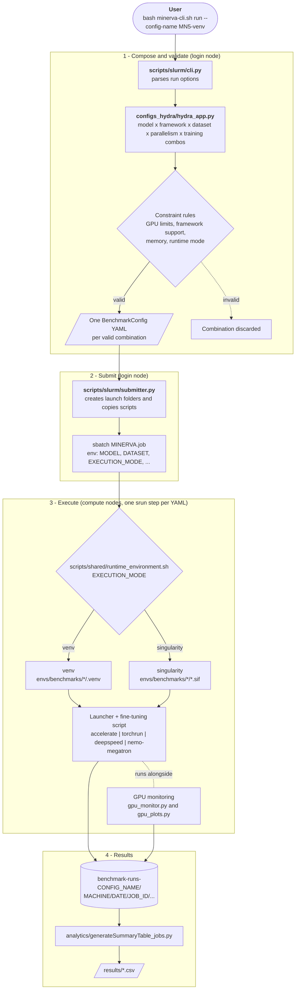

# MINERVA Training & Fine-Tuning Benchmarks

LLM training and fine-tuning benchmarks for HPC supercomputers, part of the [MINERVA](https://minerva-project.eu/) project. Designed to evaluate large language model training performance on BSC's MareNostrum 5 and other HPC systems.

These benchmarks measure:
- **Total Time to Train / Fine-tune** — End-to-end wall-clock time
- **Training throughput** — Tokens per second, TFLOPs per GPU
- **Memory consumption** — GPU VRAM usage per parallelism strategy
- **GPU utilization** — Power draw, memory bandwidth, compute utilization
- **Scaling behavior** — Single-GPU → DDP → FSDP → ZeRO → Megatron comparison

## Table of Contents

- [Documentation](#documentation)
- [Architecture](#architecture)
- [Supported Frameworks & Parallelism](#supported-frameworks--parallelism)
- [Project Structure](#project-structure)
- [Setup](#setup)
  - [0. Prerequisites](#0-prerequisites)
  - [1. Install the environments](#1-install-the-environments-install)
  - [2. Download the datasets](#2-download-the-datasets)
  - [3. Create the `.env` file](#3-create-the-env-file)
  - [4. Pick a configuration profile](#4-pick-a-configuration-profile)
- [Using `minerva-cli.sh`](#using-minerva-clish)
  - [`run` options](#run-options)
  - [Typical workflow](#typical-workflow)
- [Configuration](#configuration)
- [Results](#results)
  - [Output Structure](#output-structure)
  - [Aggregation](#aggregation)
- [Supported Machines](#supported-machines)
- [Requirements](#requirements)
- [Notes & Limitations](#notes--limitations)
- [License](#license)
- [References](#references)

---

## Documentation

| Topic | README |
|-------|--------|
| **Configuration System** (Hydra schemas, YAML configs, constraint validation) | [configs_hydra/README.md](configs_hydra/README.md) |
| **Training Scripts** (launchers, entry points, shared code, utilities) | [scripts/README.md](scripts/README.md) |
| **SLURM Job Submission** (CLI, job lifecycle, monitoring) | [scripts/slurm/README.md](scripts/slurm/README.md) |
| **Environment Management** (uv venvs, Singularity containers, CUDA versions) | [envs/README.md](envs/README.md) |
| **Datasets** (handlers, pre-tokenization) | [scripts/shared/datasets/DATASETS.md](scripts/shared/datasets/DATASETS.md) |

---

## Architecture



---

## Supported Frameworks & Parallelism

| Framework (config name) | Single-GPU (`none`) | DDP | FSDP | ZeRO-1/2/3 | ZeRO-3-Offload | Megatron (`tp/pp/cp/dp/ep/sp`) |
|-------------------------|:---:|:---:|:----:|:----------:|:--------------:|:------------------------------:|
| **HuggingFace Accelerate** (`accelerate-cuda{121,128,130}`) | — | ✅ | ✅ | — | — | — |
| **PyTorch TorchRun** (`torchrun-cuda{121,128,130}`) | ✅ | ✅ | ✅ | — | — | — |
| **Microsoft DeepSpeed** (`deepspeed-cuda{121,128,130}`) | — | — | — | ✅ | ✅ | — |
| **NVIDIA NeMo / Megatron** (`megatron-nemo-2509`) | — | — | — | — | — | ✅ |

`deepspeed-accelerate-*` framework configs exist but are currently disabled in `configs_hydra/model_framework_dataset.py`. Megatron NeMo only supports the `tulu-3-sft-mixture` dataset; the other frameworks support `alpaca` and `squadv2`.

**Models:** `gemma3_1b`, `mistral_7b`, `llama3_8b`, `llama3_70b`, `alia_40b`, `qwen2.5_7b`, `qwen2.5_72b` (`gemma3_12b` is deprecated).
**Datasets:** `alpaca`, `squadv2`, `tulu-3-sft-mixture`.

---

## Project Structure

```
training/
├── minerva-cli.sh                    # CLI entry point (uses envs/cli/.venv)
├── MINERVA.job                       # SLURM job script (one srun step per config)
├── config.sh                         # Shell config helpers (legacy)
├── .env-template                     # Template for the .env file (model/dataset paths)
├── .env                              # Your local settings (not committed)
│
├── install/                          # Setup scripts
│   ├── install-all-envs.sh           # uv sync for CLI + all benchmark venvs
│   ├── build-all-singularity.sh      # Build .sif containers from envs/benchmarks/*/*.def
│   ├── download-datasets.sh          # Download alpaca and squad_v2 into datasets/
│   └── utils.sh                      # Shared shell helpers (colors, error handler)
│
├── envs/                             # Environment definitions (see envs/README.md)
│   ├── cli/                          # CLI env (pyproject.toml, Python 3.11)
│   └── benchmarks/                   # Training envs
│       ├── cuda121-flash-attn/       # CUDA 12.1
│       ├── cuda128-flash-attn/       # CUDA 12.8
│       ├── cuda130-flash-attn/       # CUDA 13.0
│       ├── cuda130-flash-attn3/      # CUDA 13.0 + FlashAttention 3
│       └── nemo-2509/                # NeMo 25.09 container (Megatron)
│
├── configs_hydra/                    # Hydra-based configuration system
│   ├── hydra_app.py                  # Composition + validation + combo expansion
│   ├── model_framework_dataset.py    # Lists of MODELS / FRAMEWORKS / DATASETS to generate
│   ├── dataclasses_hydra/            # Python dataclass schemas
│   ├── constraints/                  # Rule-based validation
│   └── configs/
│       ├── base.yaml                 # Root schema defaults
│       ├── machine/                  # MN5/, MN5-GPP/, Jean-Zay-H100/ (--config-name)
│       ├── profile/                  # benchmark profiles (--profile)
│       └── model/  framework/  dataset/  slurm/  arch/
│
├── scripts/
│   ├── slurm/                        # CLI (cli.py), submitter, monitor, utils
│   ├── shared/                       # Framework-agnostic code (custom_train, data, args,
│   │                                 #   flops, gpu_monitor, gpu_plots, comm_metrics,
│   │                                 #   runtime_environment.sh, datasets/ handlers)
│   ├── accelerate_common/            # Accelerate DDP / FSDP launchers + scripts
│   ├── torchrun_common/              # TorchRun none / DDP / FSDP launchers + scripts
│   ├── deepspeed_common/             # DeepSpeed ZeRO launchers + scripts
│   └── nemo_megatron_common/         # NeMo / Megatron script and utilities
│
├── datasets/                         # Local datasets (alpaca, squad_v2, tulu-3-sft-mixture)
├── analytics/                        # Result aggregation
│   ├── generateSummaryTable_jobs.py  # Collect per (job, step, repeat) summaries into CSV
│   └── results.py                    # Ad-hoc result inspection
├── results/                          # Generated summary CSVs
├── benchmark-runs-{config-name}/     # Generated run folders (created by the CLI)
├── cli-logs/                         # minerva-cli.sh logs, per day
└── nemo_list_collections.py          # NeMo collections helper
```

---

## Setup

All commands below must be run from the `training/` directory (the install scripts also work from `training/install/`).

### 0. Prerequisites
- SLURM cluster with GPUs, and [`uv`](https://github.com/astral-sh/uv) available in `PATH` (required by `install-all-envs.sh` and `download-datasets.sh`).
- `singularity` or `apptainer` (only for the container runtime; required by `build-all-singularity.sh`).
- Access to the model weights (see step 3).

### 1. Install the environments (`install/`)

```bash
cd training

# CLI venv (envs/cli/.venv) + every benchmark venv (envs/benchmarks/*/.venv)
bash install/install-all-envs.sh

# (Optional, container runtime) Build one .sif per envs/benchmarks/*/ that has a .def file
bash install/build-all-singularity.sh
```

- `install-all-envs.sh` runs `uv sync` in `envs/cli` and in every folder of `envs/benchmarks/`. The CLI venv is mandatory: `minerva-cli.sh` and `MINERVA.job` use `envs/cli/.venv/bin/python`.
- `build-all-singularity.sh` builds a `.sif` next to the first `.def` file of each `envs/benchmarks/*/` folder (e.g. `envs/benchmarks/cuda130-flash-attn/singularity_uv-runtime.sif`). These are the paths referenced by the `framework/*.yaml` configs. Building may require a node with build permissions and internet access.
- Both scripts abort if run outside `training/` or `training/install/`.

To install a single environment only: `cd envs/benchmarks/<env> && uv sync`. See [envs/README.md](envs/README.md).

### 2. Download the datasets

```bash
bash install/download-datasets.sh
```

Downloads `yahma/alpaca-cleaned` into `datasets/alpaca` and `rajpurkar/squad_v2` into `datasets/` using a temporary uv venv (requires internet access; run on a login node). `tulu-3-sft-mixture` (needed by Megatron NeMo) is not downloaded by this script; place it in `datasets/tulu-3-sft-mixture` or point `DATASET_TULU3_PATH` to it.

### 3. Create the `.env` file

```bash
cp .env-template .env
```

Edit `.env` and set the paths to the model weights (`MODEL_*_PATH` variables have no default):

```bash
MODEL_GEMMA3_1B_PATH=/path/to/gemma-3-1b
MODEL_LLAMA3_8B_PATH=/path/to/llama3-8b
MODEL_LLAMA3_70B_PATH=/path/to/llama3-70b
MODEL_ALIA_40B_PATH=/path/to/alia-40b
MODEL_MISTRAL_7B_PATH=/path/to/mistral-7b
MODEL_QWEN25_7B_PATH=/path/to/qwen2.5-7b
MODEL_QWEN25_72B_PATH=/path/to/qwen2.5-72b

# Optional, default to training/datasets/...
# DATASET_ALPACA_PATH=
# DATASET_SQUADV2_PATH=
# DATASET_TULU3_PATH=
```

`.env` is loaded automatically by `configs_hydra/hydra_app.py`.

### 4. Pick a configuration profile

The `--config-name` argument selects a YAML profile in `configs_hydra/configs/`:

| Config name | Machine | Runtime |
|-------------|---------|---------|
| `MN5-venv` | MareNostrum 5 ACC (`bsc-mn5-acc`, 4×H100) | uv venv (`envs/benchmarks/*/.venv`) |
| `MN5-singularity` | MareNostrum 5 ACC | Singularity `.sif` |
| `MN5-GPP-singularity` | MareNostrum 5 GPP (`bsc-mn5-gpp`, CPU nodes) | Singularity `.sif` |
| `Jean-Zay-H100-singularity` | Jean Zay (4×H100) | Singularity `.sif` |

`MN5`, `MN5-GPP` and `Jean-Zay-H100` are base profiles; used directly, they read `runtime_env_mode` from the `RUNTIME_ENV_MODE` environment variable (`venv` or `singularity`). To support a new machine, copy one of these profiles and add the matching `arch/` and `slurm/` files (see [configs_hydra/README.md](configs_hydra/README.md)).

---

## Using `minerva-cli.sh`

`minerva-cli.sh` activates `envs/cli/.venv`, runs `python -m scripts.slurm.cli <args>`, and logs the output to `cli-logs/<date>/<time>.log` (ANSI colors stripped). It must be run from `training/` because it uses relative paths.

```bash
bash minerva-cli.sh --help
bash minerva-cli.sh run --help
```

The only available subcommand is **`run`**. `--config-name` is required.

### `run` options

| Option | Description |
|--------|-------------|
| `--config-name NAME` | **Required.** Machine config, found by file name in `configs_hydra/configs/machine/<machine>/` (e.g. `MN5-venv`). |
| `--configs-path PATH` | Hydra config directory (default `./configs_hydra/configs`). |
| `--profile NAME` | Optional benchmark profile from `configs_hydra/configs/profile/`, merged on top of `--config-name` (can set `selection:` of models/frameworks/datasets and `model.combinations`). The name is appended to the runs dir: `benchmark-runs-{config-name}-{profile}/`. |
| `--runs-dir DIR` | Base output dir (default `benchmark-runs/`). The config name is appended: `benchmark-runs-{config-name}/`. |
| `--dry-run` | Compose and validate configs and write the YAMLs, without submitting to SLURM. |
| `--models a,b` | Restrict to these models (comma separated, no spaces). |
| `--frameworks a,b` | Restrict to these frameworks (e.g. `torchrun-cuda130,deepspeed-cuda130`). |
| `--datasets a,b` | Restrict to these datasets (e.g. `alpaca,squadv2`). |
| `--nnodes N` | Override the number of nodes requested for the SLURM job. |
| `--per-model-jobs` | Submit one SLURM job per model instead of a single job. |
| `--per-nodes-jobs` | Submit one SLURM job per node count. |
| `--yaml PATH` | Submit previously generated `BenchmarkConfig` YAML files (repeatable). Cannot be combined with `--dry-run`. |

Valid names for `--models`, `--frameworks` and `--datasets` are listed in `configs_hydra/model_framework_dataset.py` and in `run --help`; invalid names abort the command.

### Typical workflow

```bash
cd training

# 1. Dry run: compose + validate, write YAMLs, do not submit
bash minerva-cli.sh run --dry-run --config-name MN5-singularity

# 2. Restrict to a subset
bash minerva-cli.sh run --dry-run --config-name MN5-venv \
    --models gemma3_1b,llama3_8b --frameworks torchrun-cuda130 --datasets alpaca

# 3. Submit everything valid as a single SLURM job
bash minerva-cli.sh run --config-name MN5-singularity

# 4. Submit one job per model / per node count
bash minerva-cli.sh run --config-name MN5-singularity --profile llama3-megatron-bf16-bf16fp8
bash minerva-cli.sh run --config-name MN5-singularity --per-model-jobs
bash minerva-cli.sh run --config-name MN5-singularity --per-nodes-jobs

# 5. Submit specific generated configs (paths come from the dry run)
bash minerva-cli.sh run --config-name MN5-singularity \
    --yaml <path/to/yaml-configs/file.yaml>
```

After submission the CLI prints the results folder `benchmark-runs-{config-name}/{machine}/{date}/{jobid}`. SLURM logs are written to `.../{jobid}/sbatch-slurm-logs/MINERVA-JOB-{jobid}.{out,err}`. Track jobs with `squeue -u $USER` and cancel with `scancel`.

The `status`, `cancel` and `rerun` subcommands are currently disabled in `scripts/slurm/cli.py`. See [scripts/slurm/README.md](scripts/slurm/README.md) for the job lifecycle.

---

## Configuration

The system uses [Hydra](https://hydra.cc/) for config composition. Key files:

| File | Purpose |
|------|---------|
| `configs_hydra/configs/{MN5*,MN5-GPP*,Jean-Zay-H100*}.yaml` | Machine profiles (env vars, modules, runtime mode, binds) |
| `configs_hydra/configs/model/*.yaml` | Model definitions (architecture dims, weights path from `.env`) |
| `configs_hydra/configs/framework/*.yaml` | Framework specs (parallelism, scripts, venv / `.sif` paths, allowed datasets) |
| `configs_hydra/configs/dataset/*.yaml` | Dataset definitions (path, task type, sequence length) |
| `configs_hydra/configs/slurm/*.yaml` | SLURM batch directives (account, QoS, partition, GPUs) |
| `configs_hydra/configs/arch/*.yaml` | HPC architecture specs (GPUs per node, peak FLOPs, interconnect) |
| `configs_hydra/model_framework_dataset.py` | Default `MODELS`, `FRAMEWORKS`, `DATASETS` lists to expand |

See [configs_hydra/README.md](configs_hydra/README.md) for the full reference (constraints, adding new models/datasets/frameworks). To change the default set of generated combinations, edit the lists in `configs_hydra/model_framework_dataset.py`; for one-off runs use `--models`, `--frameworks` and `--datasets`.

---

## Results

### Output Structure

```
benchmark-runs-{config-name}/
├── slurm-monitor/{date}/...                    # Submitted job bookkeeping
└── {machine}/{date}/
    └── {jobid}/
        ├── sbatch-slurm-logs/                  # MINERVA-JOB-{jobid}.out / .err
        └── ...{model}/{framework}/{dataset}/.../
            ├── yaml-configs/                   # Composed BenchmarkConfig YAML
            └── run_id-{N}/launch-{R}/          # One folder per repeat (default 2)
```

Each `launch-{R}` folder holds a copy of the scripts used, logs, metrics and GPU profiler output.

### Aggregation

```bash
# From training/
source envs/cli/.venv/bin/activate
python -m analytics.generateSummaryTable_jobs <JOB_ID> [<JOB_ID> ...] \
    --root benchmark-runs-MN5-singularity/bsc-mn5-acc \
    --output results/training-summary.csv
```

Writes one CSV row per `(job, step, repeat)`. Existing summaries are stored in `results/`. Run `python -m analytics.generateSummaryTable_jobs --help` for all options.

---

## Supported Machines

| Machine | Config profile | Hardware |
|---------|----------------|----------|
| **MareNostrum 5 ACC (BSC)** | `MN5-venv`, `MN5-singularity` | 4× H100-SXM (64 GB) per node, InfiniBand NCCL settings in `MN5.yaml` |
| **MareNostrum 5 GPP (BSC)** | `MN5-GPP-singularity` | CPU-only nodes (`gpp` partition) |
| **Jean Zay (IDRIS)** | `Jean-Zay-H100-singularity` | 4× H100-SXM (80 GB) per node |

Machine-specific NCCL/environment variables live in the `machine.env` section of each profile.

---

## Requirements

- **HPC cluster** with SLURM
- **NVIDIA GPUs** compatible with CUDA 12.1 / 12.8 / 13.0
- **uv** (venv runtime, environment installation, dataset download)
- **Singularity/Apptainer** (container runtime)
- **Python 3.11** for the CLI env; benchmark envs pin their own Python (managed by `uv`)
- **InfiniBand** networking for multi-node NCCL communication

---

## Notes & Limitations

- FSDP behavior depends heavily on model architecture and shard configuration.
- Performance may vary significantly across GPU architectures.
- The `venv` runtime needs `install/install-all-envs.sh` run on a filesystem visible to compute nodes; the `singularity` runtime needs the `.sif` files built.

---

## License

See [LICENSE](LICENSE). Contact: **minerva_support@bsc.es**.

---

## References

1. **Accelerate:** [GitHub](https://github.com/huggingface/accelerate), [docs](https://huggingface.co/docs/accelerate/index)
2. **DeepSpeed:** [GitHub](https://github.com/deepspeedai/DeepSpeed), [deepspeed.ai](https://www.deepspeed.ai/)
3. **PyTorch:** [GitHub](https://github.com/pytorch/pytorch), [TorchRun docs](https://docs.pytorch.org/docs/stable/elastic/run.html)
4. **Transformers:** [docs](https://huggingface.co/docs/transformers/index)
5. **NVIDIA NeMo / Megatron:** [GitHub](https://github.com/NVIDIA/NeMo)
